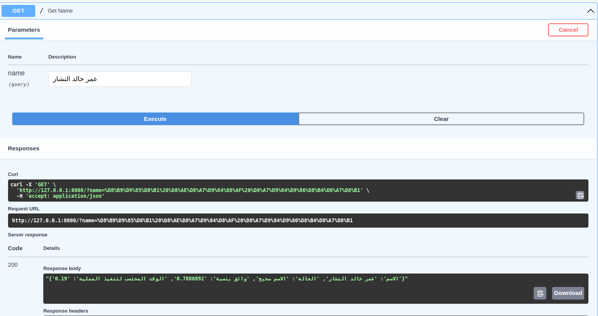
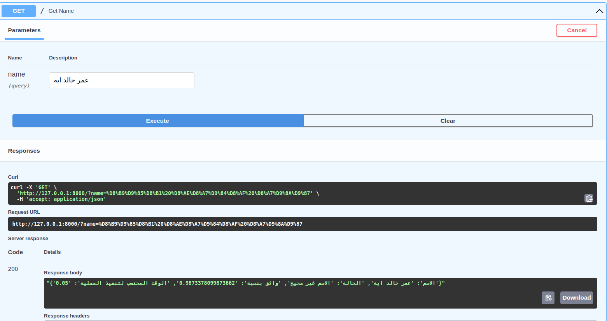
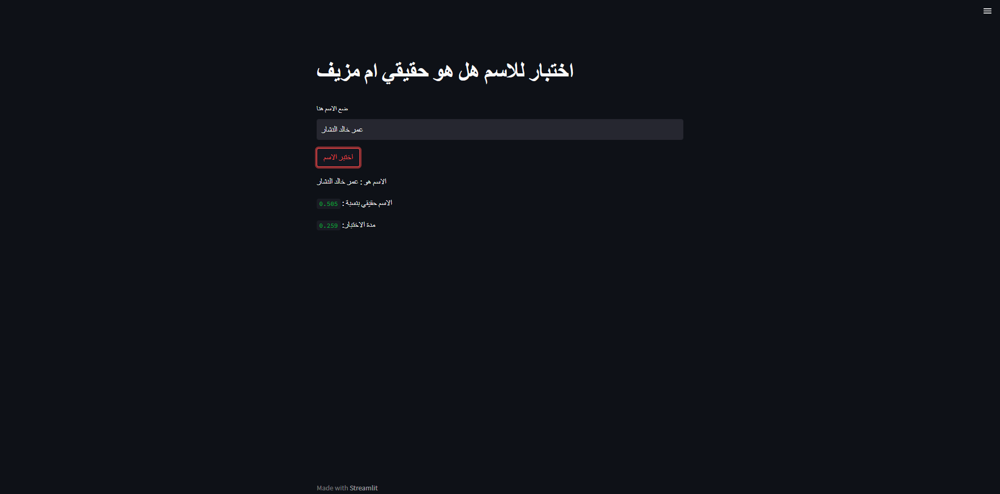
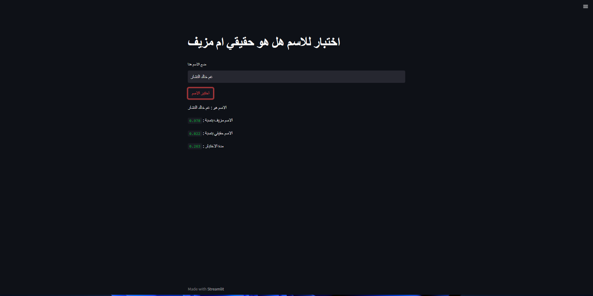
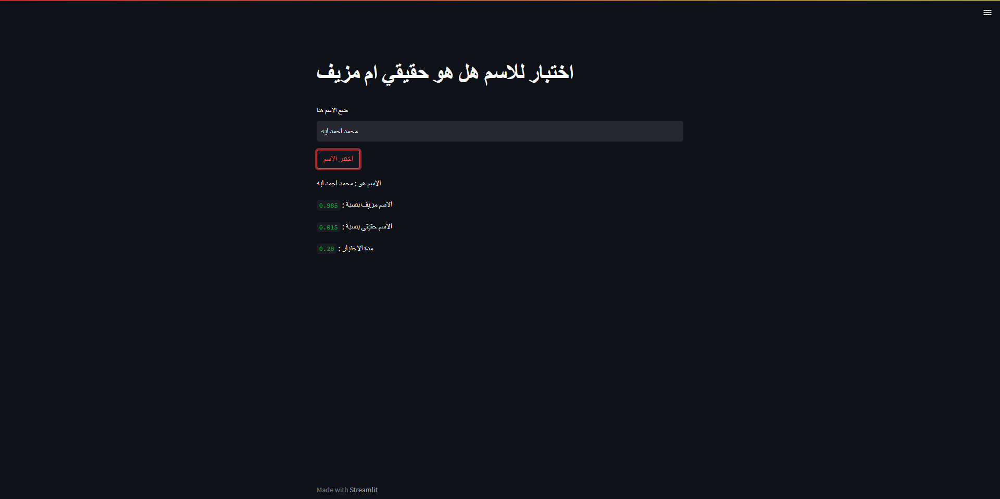

# Real-Names-Checker
 The purpose of this project is determine if the (3 words name) is real or fake

 ## Files Structure   

  
  Data -> contains the data files   
│  
└───Helpers -> conatine all helpers function nedded for this project    
│   │  
│   └───data_generation.py -> to genrate the data  
│   │    
│   └───data_preprocessing.py -> applt the preprocessing techniques on the data   
│   │  
│   └───tokenizer.py -> Apply tokenization and padding to text  
│   │  
│   └───utils.py -> load the model and tokenizer  
│   
│       
└───final_models -> conatin deep learning model weights and tokenizer pickle file   
│   │  
│   └───tokenizers -> contain the tokenizer pickle file            
│       
└───models -> contain models Implementations  
│   │  
│   └───lstm.py => contains the LSTM network implementation       
│   │  
│   └───CNN.py => contains 1 dimensional CNN network implementation   
│       
└───shared_param -> contains all shared parameters such as tokenizer path and model path               
│   
└───streamlit.py -> contains the streamlit application
│   
└───train.py -> contain the training process  
│   
└───test.py -> contain the testing process  
│  
└───server.py -> the api file  


### To run the docker image
```
docker-compose build
docker-compose up
```
The project will run and you will find the the link of API to test the project  
http://0.0.0.0:8000/
Go to the link in the screen shot ```http://127.0.0.1:8000/docs``` to open the swager of FastAPI and text the model like the below picture   
  
    


### To run the project using virtual environemnt 
```
python -m venv env   
 .\env\Scripts\activate

pip install -r requirements.txt  

uvicorn serve:app  
```


### Run the streamlit app on localhost after install the virtual environment 
```
streamlit run streamlit.py
```
### Streamlit tests
- Real Name
  
- Fake names
    
    

### Run the trainning script
```
python train.py
```
### Run the test script

```
python test.py --name use_your_text
e.x:
python test.py --name "عمر خالد النشار"


```
## About Dataset.
### 1- Data Generation
I used a random generation to genrate the dataset I used two ways:  
1- I created a random real names where the second and last name must be a ``` Male``` names.  
2- I created a random fake names where I made some wrong letters and made the last name and second name be a ``` Female``` names.   
```.    
 


#### 2-Data Preprocessing  
I used normalization techniques to perprocess the dataset
1- ``` [إأآا] ``` to ``` ا ```  
2- ```ي``` to ``` ى ```  
3- ```ة``` to ```ه```    

  
 ## Approach model  
 ### 1- LSTM approach:  
 - I used a basic LSTM model with a fully connected layers ended by layer with a sigmoid activation function to deal with this problem as classification problem with confidence between 0 and 1


 ### CNN approach:  
 - 2- I used a basic 1x1 CNN model with a fully connected layers ended by layer with a sigmoid activation function to deal with this problem as classification problem with confidence between 0 and 1


 ## Conclusion 
  The model do will to undersatnd the dataset and made a good results where:  
  Training accuracy: 0.9723%  
  Testing accuracy: 0.90%  
  
